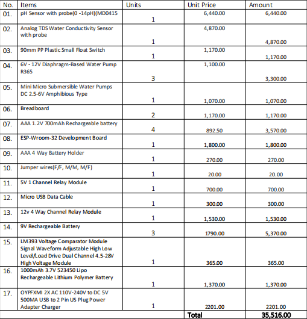

[comment]: # "This is the standard layout for the project, but you can clean this and use your own template"

# Automated Hydroponic System

---

<!-- Image (photo/drawing of the final hardware) should be here -->

<!-- This is a sample image, to show how to add images to your page. To learn more options, please refer [this](https://projects.ce.pdn.ac.lk/docs/faq/how-to-add-an-image/) -->

<!--  -->

#### Table of Contents
1. [Introduction](#introduction)
3. [Solution Architecture](#solution-architecture )
4. [Hardware & Software Designs](#hardware-and-software-designs)
5. [Testing](#testing)
6. [Detailed budget](#detailed-budget)
7. [Conclusion](#conclusion)
8. [Links](#links)

## Introduction

The project "IoT-Based Automated Hydroponic System" aims to develop a modern and sustainable approach to hydroponic farming that maximizes efficiency by using technology to monitor and control growth conditions, reducing resource consumption, and enabling users to make data-driven decisions for better crop management.
Customers want fresh, locally grown produce, and hydroponic farming provides an eco-friendly, space-efficient, and resource-saving solution. They are looking for high-quality, user-friendly, and automated hydroponic systems that can be easily monitored and managed remotely to meet their demand for convenience and sustainability.The market for hydroponic systems, particularly in urban and controlled environments, is growing. This presents an opportunity to develop a product 
that is not only cost-effective but also provides value by integrating automation and data-driven insights. Such a product can cater to the increasing demand for sustainable and efficient farming methods while remaining economically viable for both individual consumers and businesses

## Solution Architecture

High level diagram + description

## Hardware and Software Designs

Detailed designs with many sub-sections

## Testing

Testing done on hardware and software, detailed + summarized results

## Detailed budget

<!--All items and costs

| Item          | Quantity  | Unit Cost  | Total  |
| ------------- |:---------:|:----------:|-------:|
| Sample item   | 5         | 10 LKR     | 50 LKR |-->

## Conclusion

What was achieved, future developments, commercialization plans

## Introduction Video
<video width="640" height="360" controls>
  <source src="videos/HYDROGROWPRO.mp4" type="video/mp4">
  Your browser does not support the video tag.
</video>

## Team
-  E/19/060, Danujan S., [email](mailto:e19060@eng.pdn.ac.lk)
-  E/19/131, Hansachapa A.P.K., [email](mailto:e19131@eng.pdn.ac.lk)
-  E/19/166, W.W.K.Jayathunga, [email](mailto:e19166@eng.pdn.ac.lk)
-  E/19/224, M.M.S.H. Madhurasinghe, [email](mailto:e19224@eng.pdn.ac.lk)
-  E/19/266, Nithusikan T., [email](mailto:e19266@eng.pdn.ac.lk)

## GitHub Links

- [Project Repository](https://github.com/cepdnaclk/cepdnaclk/e19-3yp-Automated-Hydroponic-System)
- [Project Page](https://cepdnaclk.github.io/cepdnaclk/e19-3yp-Automated-Hydroponic-System)
- [Department of Computer Engineering](http://www.ce.pdn.ac.lk/)
- [University of Peradeniya](https://eng.pdn.ac.lk/)

### CN Portfolio Links
[//]: # (Please refer this to learn more about Markdown syntax)
[//]: # (https://github.com/adam-p/markdown-here/wiki/Markdown-Cheatsheet)
